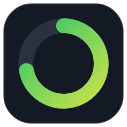
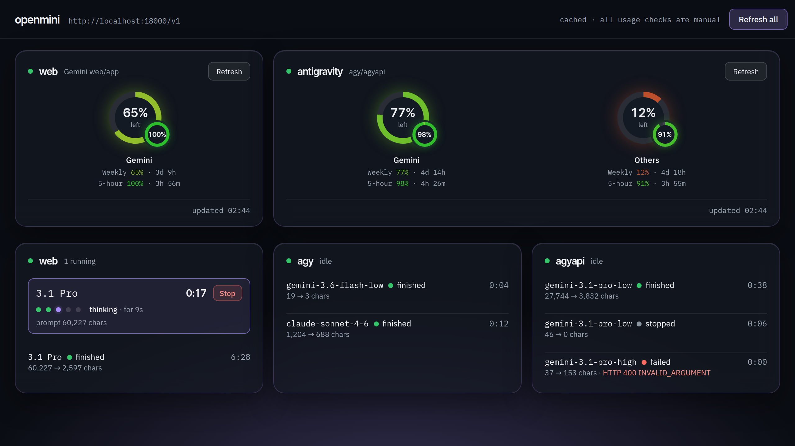

<p align="center"></p>

# openmini

Your Google AI Pro subscription as an OpenAI-compatible endpoint, on your own machine. One exe, one port, three
ways to reach Google behind it:

- **web** drives the Gemini web app in a signed-in browser. Uses the Gemini app's quota.
- **agyapi** calls the Antigravity service directly, with the session of Google's Antigravity CLI. No message cap,
  real token counts. The backend to use for long prompts.
- **agy** runs the Antigravity CLI itself. Same quota as agyapi, but the CLI cuts messages after 192,000 bytes and
  adds its own prompt on top of yours.


## Get it (Windows)

You need a Google account on a plan that includes the Gemini app and Antigravity, such as AI Pro. openmini charges
nothing and adds nothing; it uses what your subscription already gives you.

1. Download `openmini-<version>-windows-amd64.zip` from Releases and unzip it into a folder of your own, not
   Downloads. Everything openmini writes stays in that folder.
2. Double-click `openmini.exe`. Windows flags the unsigned exe: choose "More info", then "Run anyway". The first
   time, this runs the setup wizard, not the server:
   - **Antigravity.** If Google's Antigravity CLI (`agy`) is missing, it offers to run Google's installer, then to
     sign you in; a browser opens for that.
   - **Gemini web app.** Say yes and it downloads a browser once (about 150 MB) and opens a window for you to sign
     in to Google. The session is kept in `data\browser-profile`.
   - A desktop shortcut and a Start menu entry, if you want them.
   - At the end it offers to start openmini right away.
3. From then on, double-clicking `openmini.exe` (or the shortcut) starts the server. Windows Firewall asks once;
   allow it if other devices should reach it. The dashboard is at <http://localhost:18765/usage>, the API at
   `http://localhost:18765/v1`. To try it from PowerShell:

   ```powershell
   '{"model":"agyapi/gemini-3.1-pro","messages":[{"role":"user","content":"Write a two-sentence story about a cat who learns to sail."}]}' | curl.exe -s http://localhost:18765/v1/chat/completions -H "Content-Type: application/json" -d "@-"
   ```

### Running it

openmini runs in a small window of its own that shows the log. Minimise hides it to the notification area: click the
tray icon to bring it back, right-click for the menu. Close stops openmini, as does Quit in the tray menu or
`openmini stop` in PowerShell; there is no console to press Ctrl+C in unless you start it with `openmini serve
--console`. The terminal you launched it from can be closed. `openmini doctor` checks everything, `openmini login`
redoes the Gemini sign-in, `openmini setup` runs the wizard again.

**Updating.** Download the new zip, stop openmini, replace `openmini.exe`, start it again. `config.toml` and the
`data` folder (your Gemini sign-in, agy's state, history) stay as they are; `config.example.toml` in the zip shows
any new settings, which all have working defaults when absent.

## The dashboard



- **Usage wheels.** Big wheel = weekly limit, little wheel = 5-hour limit, colour from green to red by what is left.
  One tile for the Gemini app, one for Antigravity; agy and agyapi draw from the same Antigravity quota.
- **All usage checks are manual.** Opening the page fetches nothing; each Refresh asks one backend.
- **Requests.** One block per backend: running requests with their phase (queued, submitted, thinking, generating), a
  timer and a Stop button, then the newest 10 finished ones. Older requests are in the day's log file. The page
  updates by push while something runs; there is no polling.

## Reaching it from your phone

Don't open the port to the internet. Put the PC and your phone on a [Tailscale](https://tailscale.com) tailnet
instead: nothing to configure in openmini, and the same address works from anywhere, for example
`http://desktop-name:18765/v1` as the base URL in your phone's chat app and `/usage` for the dashboard.
`openmini doctor` prints the address once Tailscale is up. Set `api_keys` if other people share the tailnet.

If the phone cannot reach it while the PC's own browser can, Windows Firewall is blocking the port for other
machines. Open it for the tailnet only, in PowerShell run as administrator:

```powershell
netsh advfirewall firewall add rule name="openmini" dir=in action=allow protocol=TCP localport=18765 remoteip=100.64.0.0/10
```

To close it:

```powershell
netsh advfirewall firewall delete rule name="openmini"
```

## Good to know

- **Tier limits are Google's.** The Antigravity service has renamed `gemini-3.1-pro-high` to `gemini-pro-agent`;
  openmini sends the new id when given the old one, so either works. When the Gemini app's 5-hour window runs out it locks Pro and Flash and only Flash-Lite
  answers; openmini refuses instead of silently downgrading (`unavailable_action`). The dashboard shows locks and
  reset times.
- **Size limits.** The Gemini web prompt box refuses single lines over about 32k characters; pasted prompts arrive
  intact to about 100k characters and larger ones go as a file. agy drops everything after the first 192,000 bytes
  of a message. `oversize_action` says what openmini does with an agy prompt that would be cut: `agyapi` reroutes it to
  agyapi (the default), `web` sends it to the web backend as a file, `warn` lets agy cut it and notes that, `fail`
  refuses it.
- **Temporary chats.** Every web request starts as a Gemini temporary chat, so nothing openmini sends is kept in
  the account's history or used as context for later chats. `temporary_chat = false` in `[web]` turns that off.
- **History.** `[history] enabled = true` writes one JSON file per request to `data/history`, named
  `<time>_<backend>_<model>_<id>.json`: the request body exactly as received under `request`, the completion
  exactly as returned under `response`, and openmini's notes (timings, phase, reroute) under `openmini`. Off by
  default; when on, prompts and replies are on disk, so keep the folder private.
- **Lanes.** The web backend answers one request at a time by default. `lanes = 2` (or 3) in `[web]` opens that
  many chat tabs in the same browser so requests overlap; each tab costs memory and the account's quota is spent
  faster. agy and agyapi already run requests in parallel.
- **Pass-through.** Whatever Gemini answers is the reply, including its own error notices and refusals. Failures
  to get any reply come back as content prefixed `[openmini/<backend>]`, never as HTTP errors, except malformed
  requests and bad API keys.
- **Logs** go to `logs\<date>.log`, one file per day, old ones removed. They hold ids, sizes and timings, never
  prompt or reply text.

## If the web backend seems stuck

Nothing times out by default, so on a long prompt at a busy hour the Gemini app may think for minutes before the
first word and openmini waits. The dashboard shows what a request is doing; press its **Stop** button to end one.
To make openmini give up on its own, set `start_timeout` (`[web]`) or `timeout` (`[server]`) in `config.toml`, in
seconds, `0` meaning no limit.

## Security

- `data\browser-profile` is a signed-in Google session, and agy's session is a full Antigravity login. Together
  they are your Google account. Keep the folder private; never share or commit it.
- Do not expose the port to the internet. Localhost and your own tailnet (Tailscale) are the intended reach. On
  any shared network set `api_keys` in `config.toml`; then every request needs `Authorization: Bearer <key>` and
  only `/health` stays open. The debug endpoints below are covered by the same key.
- openmini is not affiliated with Google. It automates your own account the way your browser and the official CLI
  do; use it within Google's terms.

## Other platforms

Linux, WSL and macOS:

```bash
go build -o openmini . && ./openmini setup
curl -s localhost:18765/v1/chat/completions -H "Content-Type: application/json" \
  -d '{"model":"agyapi/gemini-3.1-pro","messages":[{"role":"user","content":"hello"}]}'
```

The Gemini sign-in needs a screen once (WSL needs WSLg); on a headless server, sign in elsewhere and copy
`data/browser-profile` over. Install agy with `curl -fsSL https://antigravity.google/cli/install.sh | bash` and run
`agy` once; over SSH it prints a URL and takes a code back. agyapi reads agy's token file there. There is no
window or tray icon outside Windows: the server stays in the terminal.

## Endpoints

| Endpoint | Purpose |
|---|---|
| `POST /v1/chat/completions` | OpenAI chat completions, streaming or not |
| `GET /v1/models` | one entry per model of every enabled backend, under its family name (see below) |
| `GET /all/v1/models`, `POST /all/v1/chat/completions` | the same endpoints with every model a backend has, under the backend's own names |
| `GET /usage` | the dashboard (`/` redirects here) |
| `GET /usage/cached`, `POST /usage/refresh?backend=` | the cache behind it; a refresh asks one backend |
| `GET /status` (`?format=text`), `GET /status/stream` | what every request is doing, once or pushed as server-sent events |
| `POST /requests/stop?id=` | cancel a running request |
| `POST /shutdown` | stop the server; accepted only from the same machine (`openmini stop`) |
| `GET /health` | backend readiness |

### Model names

A model is `<backend>/<name>`, for example `web/3.1 Pro` or `agyapi/gemini-3.1-pro`. `GET /v1/models` lists what is
on offer; a bare name that exists in only one backend also works, otherwise it goes to `default_backend`.

- **`/v1` shows one name per model.** Where a model comes in thinking levels, the low one stands for it and the
  suffix is dropped: `gemini-3.8-flash` means `gemini-3.8-flash-low`, `claude-opus-4-6` means the thinking variant.
- **`/all/v1` shows every model** under the backend's own name, levels and all. Use it to pick a level yourself;
  `[models]` in the config sets which level `/v1` shows and what to hide.
- **Extended thinking** (延伸思考) is a Gemini switch, not a model: `web/3.1 Pro` is plain Pro, `web/延伸思考` turns it
  on, and it appears on `/all/v1` only.

## Configuration

`config.toml` sits next to the exe; the wizard writes it from `config.example.toml`, and the comments in that file
explain every setting. The ones people change: `port`, `default_backend`, `api_keys`, which backends are
`enabled`, the web backend's model (`3.1 Pro`, `3.8 Flash`, `3.5 Flash-Lite`), and `oversize_action`.

## Development

Build the Windows exe from any platform: `GOOS=windows GOARCH=amd64 go build -o dist/openmini.exe .`

openmini has run stably across a full day at every model and prompt sizes up to 300k characters; the readings are
in [LATENCY.md](LATENCY.md). MIT licensed.
